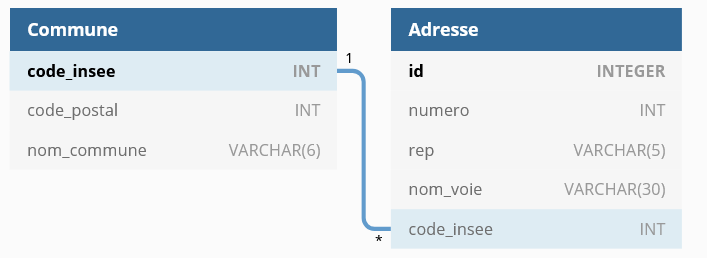
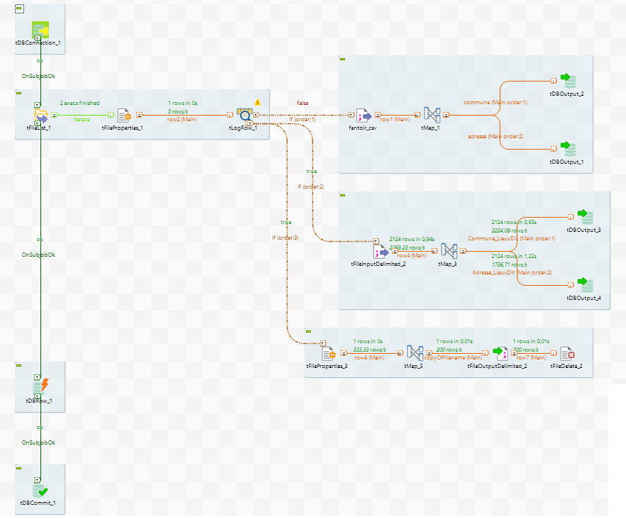

# Fantoir-groupe3

La société Establish a besoin d'une base de données qui recense les différentes adresses postales françaises pour son application de gestion. Elle possède une source de données mais ne sait pas l'utiliser en tant que telle pour son application (principalement à cause de la volumétrie du fichier). Elle sollicite votre aide pour en faire quelque chose.

### Pré-requis

* Java 1.8

* Eclipse

### Installation

* une base de donnée sqlite "vide" est disponible [data/out/fantoir.db](Fantoir/data/out/fantoir.db)

* en cas de création de la bdd, les scripts sont disponible [data/scripts/fantoire.DDL](main/Fantoir/data/scripts/fantoire.DDL)

* mettre à jour les chemins d'accés dans le fichier [src/main/resources/application.properties](Fantoir/src/main/resources/application.properties)

* dans le répertoire de l'application, lancer la commande ./mvnw.cmd install, ou via Eclipse > click droit sur le projet > maven > download source

### Business implémentation

* traitement des fichiers adresses et lieux-dits : intégration dans la base de donnée

* service de récupération des adresses correspondant à une entrée utilisateur

http://localhost:8080/SearchAdress/rue%vivaldi

* service de récupération des adresses pour un code postal utilisé

http://localhost:8080/SearchAddressByPostalCode/1750

* service qui donne les Communes ayant le plus d'entrée dans le référentiel

http://localhost:8080/SearchAddressByTopCounts/20

* service qui intègre un certain nombre de fichiers adresse ou lieux-dits dans la base de donnée

http://localhost:8080/PushFile/20

**Pour pouvoir tester les services, il faut que des données soit présentes en base de donnée, via localhost:8080/PushFile/**

### Base de donnée

### Workflow Talend

