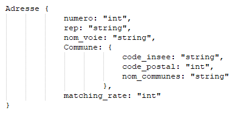
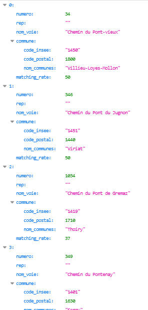

# Fantoir-groupe3

La société Establish a besoin d'une base de données qui recense les différentes adresses postales françaises pour son application de gestion. Elle possède une source de données mais ne sait pas l'utiliser en tant que telle pour son application (principalement à cause de la volumétrie du fichier). Elle sollicite votre aide pour en faire quelque chose.

### Pré-requis

* Java 1.8

* Eclipse ou un autre IDE (projet fait sous Eclipse)

### Installation

* une base de donnée sqlite "vide" est disponible : [data/out/fantoir.db](Fantoir/data/out/fantoir.db)

  * en cas de création de la bdd, les scripts sont disponible : [data/scripts/fantoire.DDL](main/Fantoir/data/scripts/fantoire.DDL)

* mettre à jour les chemins d'accés dans le fichier [src/main/resources/application.properties](Fantoir/src/main/resources/application.properties)

* dans le répertoire de l'application, lancer la commande ./mvnw.cmd install, ou via Eclipse > click droit sur le projet > maven > download source

### Business implémentation

* traitement des fichiers adresses et lieux-dits : 
 1. récupération des fichiers à partir de la source : seul les fichiers qui n'ont pas déjà été intégrés seront traités
 2. dézip des fichiers
 3. intégration à la base de donnée via un job talend intégré à l'application
 4. nettoyage du répertoire d'entrée
 5. mémorisation des fichiers intégrés 

* recherche par adresse :
  * recherche de chaines partielles, du type "rue du pont Alby"
  
* recherche des adresses pour un code postal
  * attention, un code postal peut correspondre à plusieurs villes

* recherche des villes ayant le plus d'entrée
  * utile pour les tests

### Utilisation

**Pour pouvoir tester les services, il faut que des données soit présentes en base de donnée, via localhost:8080/PushFile/** 

* service de récupération des adresses correspondant à une entrée utilisateur

http://localhost:8080/SearchAdress/adresse

> **adresse** : chaine de caractère correspondant à l'adresse recherchée

* service de récupération des adresses pour un code postal utilisé

http://localhost:8080/SearchAddressByPostalCode/code_postal
> **code_postal** : code postal recherché

* service qui donne les Communes ayant le plus d'entrée dans le référentiel

http://localhost:8080/SearchAddressByTopCounts/top_number
> **top_number** : nombre de villes recherchée

* service qui intègre un certain nombre de fichiers adresse ou lieux-dits dans la base de donnée

http://localhost:8080/PushFile/nb_fichiers
> **nb_fichiers** : nombre de fichiers à intégrer

### Type de retour

Format du json:

Exemple de résultat

> http://localhost:8080/SearchAdress/34%20chemin%20du%20pont

### Base de donnée

### Workflow Talend

Les sources du projet Talend sont disponible [ici](Fantoir/Talend_project)

